# Laporan Praktikum Basis Data - Pertemuan ke 2
**Nama:** Aulia Indah Agustina
**NIM:**25430073
**Kelas:** C
**Tanggal:** 05/10/2025
**Dosen:** Dedi Irawan, S.Kom., M.T.I.

## 1. Tujuan Praktikum
- Praktikum ini bertujuan untuk mengenali aktivitas organisasi, aktor, dan proses bisnis berdasarkan narasi, wawancara, serta dokumen yang ada. Di samping itu, praktikum dilaksanakan untuk mengidentifikasi elemen data, kandidat entitas, dan regulasi bisnis dari dokumen sumber, kemudian menyusun matriks proses-data (CRUD) serta kamus data awal dengan informasi penanggung jawab data. Praktikum juga bertujuan untuk menghasilkan kebutuhan data dan informasi yang spesifik serta dapat diuji.

## 2. Ringkasan Dasar Teori
- Analisis kebutuhan data adalah langkah untuk memahami data yang diperlukan dalam sebuah organisasi sebelum data tersebut diatur menjadi basis data. Analisis dilakukan dengan meneliti berbagai sumber seperti wawancara, observasi, dokumen sumber, dan sistem yang ada untuk memahami aktivitas, proses bisnis, serta data yang digunakan. Melalui proses tersebut, dapat diidentifikasi entitas, elemen data, aturan bisnis, dan kebutuhan informasi yang dibutuhkan oleh organisasi.Dalam analisis kebutuhan data, CRUD berfungsi untuk mengamati keterkaitan antara proses bisnis dan data. CRUD mencakup Create untuk menghasilkan data, Read untuk melihat data, Update untuk mengubah data, dan Delete untuk menghilangkan data. Di samping itu, kamus data awal berfungsi untuk menggambarkan elemen data beserta contohnya, aturan atau ciri-cirinya, serta pihak yang bertanggung jawab atas data tersebut.Data dan informasi yang dihasilkan sebaiknya memiliki sifat yang spesifik, terukur, dan dapat diuji, agar dapat menjadi dasar dalam tahap perancangan basis data selanjutnya.

## 3. Hasil Langkah Percobaan (tangkapan layar + keterangan)

### 3.1 Identifikasi Proses Bisnis
- Pada fase ini dilakukan pengenalan proses bisnis di Toko Daring Aulia Indah berdasarkan aktivitas utama organisasi. Proses yang dihasilkan mencakup pengelolaan katalog produk, pembuatan order, pencatatan transaksi, pemrosesan dan pengiriman order, serta pendaftaran pelanggan. 

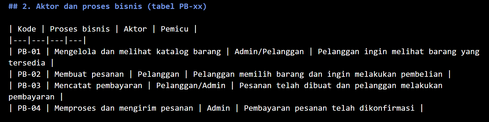

### 3.2 Identifikasi Dokumen Sumber
-Dalam langkah ini, dilakukan pengenalan terhadap dokumen yang dapat berfungsi sebagai sumber kebutuhan data untuk toko online. Dokumen utama digunakan untuk memahami data yang diperlukan dalam proses pemesanan, pembayaran, dan pengiriman. Dari dokumen itu, selanjutnya diturunkan elemen data serta entitas yang menjadi kandidat.

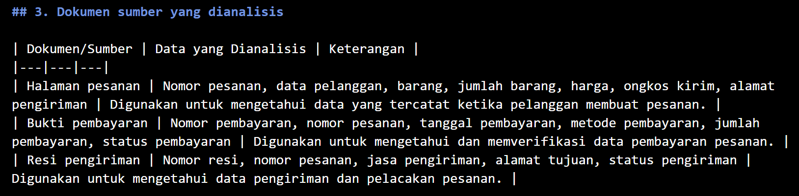

### 3.3 Identifikasi Entitas Kandidat dan Elemen Data
- Berdasarkan dokumen sumber dan kegiatan toko online, diperoleh sejumlah entitas calon, yaitu Konsumen, Produk, Pesanan, Rincian Pesanan, Pembayaran, dan Pengiriman. Setiap entitas kemudian memiliki data elemen yang dibutuhkan untuk menyimpan informasi.

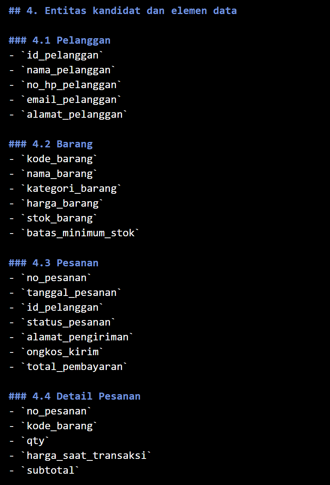
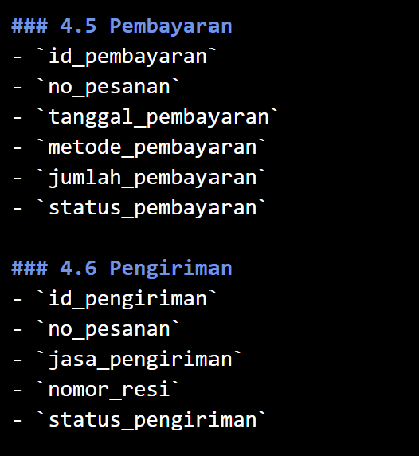

### 3.4 Identifikasi Aturan Bisnis
- Pada tahap ini diatur ketentuan yang harus dipatuhi dalam pengelolaan data toko online, seperti keunikan identitas pelanggan dan produk, stok yang tidak boleh kurang dari nol, pesanan yang harus memiliki setidaknya satu detail, serta pencatatan harga barang saat transaksi. 

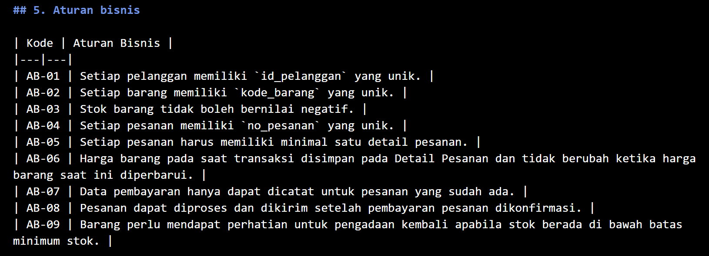

### 3.5 Identifikasi Kebutuhan Informasi
- Kebutuhan informasi ditentukan berdasarkan data yang perlu diolah untuk menghasilkan informasi. Kebutuhan tersebut meliputi daftar barang, daftar pesanan, informasi penjualan, status pembayaran dan pengiriman, serta informasi barang yang stoknya kurang dari batas minimum.

### 3.6 Penyusunan Matriks CRUD
- Matriks CRUD dipakai untuk menggambarkan tindakan yang dijalankan setiap proses bisnis terhadap entitas data. Proses yang digunakan meliputi Create (C), Read (R), Update (U), dan Delete (D).

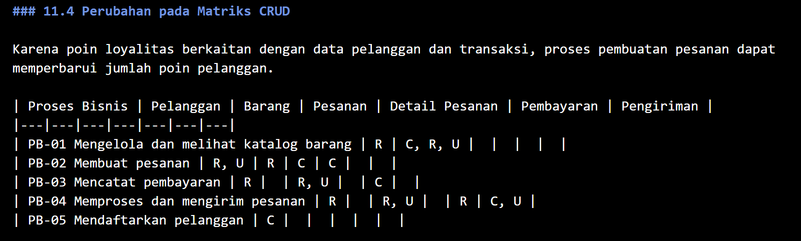

### 3.7 Penyusunan Kamus Data Awal
- Kamus data awal disiapkan untuk menjelaskan elemen data yang digunakan dalam setiap entitas. Kamus data mencakup nama elemen data, entitas, penjelasan, contoh, aturan atau keterangan, dan pihak yang bertanggung jawab atas data.

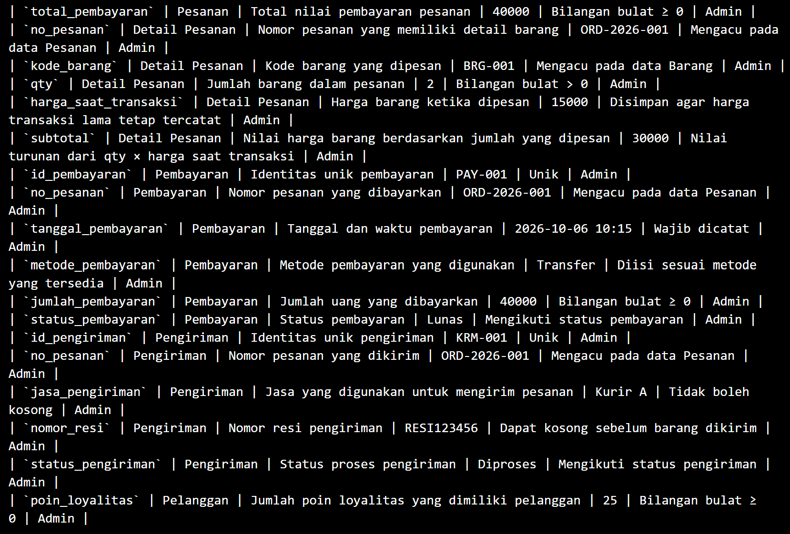

### 3.8 Kebutuhan Non-Fungsional Data
- Kebutuhan non-fungsional data disusun dengan memperhatikan volume data, masa simpan data, privasi, dan hak akses. Dalam proyek ini juga ditentukan estimasi volume transaksi harian dan batas maksimum item dalam satu transaksi berdasarkan parameter P.

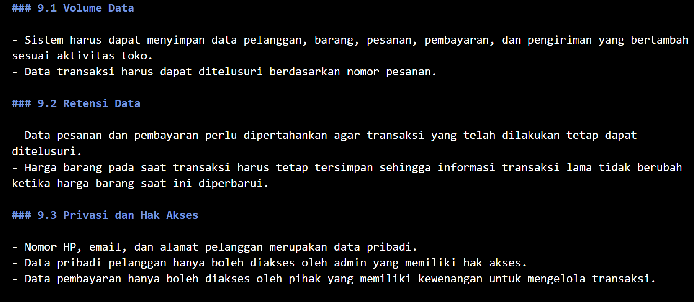

### 3.9 Perhitungan Parameter Project
- Dengan nilai P = 2, didapatkan batas maksimum 4 item per transaksi dan estimasi volume transaksi sekitar 50 transaksi setiap hari. Parameter P dihitung menggunakan dua angka terakhir dari NIM.

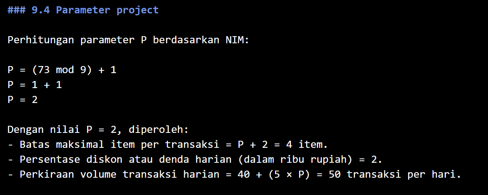

## 4. Jawaban Titik Analisis

**Analisis 1**
- Nota harus tetap mencatat harga saat transaksi karena harga barang bisa berubah di masa mendatang. Jika nota hanya mencatat harga terbaru dari data barang, maka transaksi sebelumnya dapat muncul dengan harga yang berbeda dari harga saat transaksi itu sebenarnya dilakukan. Dengan menyimpan harga pada saat transaksi dalam rincian penjualan, nilai transaksi sebelumnya tetap relevan dengan keadaan saat pembelian dilakukan. Ini juga menjawab keluhan dari ketua koperasi karena laporan dan sejarah transaksi harus tetap mencerminkan nilai yang akurat pada saat transaksi.

**Analisis 2**
- Salah satu alasan untuk tidak menyimpan subtotal dan total adalah karena nilainya dapat dihitung ulang dari jumlah barang dan harga saat transaksi, sehingga tidak perlu menyimpan data yang sebenarnya dapat diambil dari data lainnya. Namun, keseluruhan mungkin masih disimpan untuk mempermudah proses pencatatan atau pengambilan nilai transaksi tanpa perlu menghitung ulang setiap kali data digunakan. Penentuan mengenai penyimpanan nilai turunan itu akan dilakukan pada fase perancangan basis data selanjutnya.

**Analisis 3**
- Ketidakadaan operasi Create (C) pada entitas Pemasok menunjukkan bahwa proses bisnis untuk menciptakan atau menambah data pemasok baru belum ada. Oleh sebab itu, diperlukan penambahan proses bisnis untuk mengelola atau mendaftarkan data supplier agar entitas Supplier memiliki proses yang melakukan Create. Selain itu, penting untuk mengevaluasi proses pengelolaan anggota guna mengetahui pihak yang bertanggung jawab atas perubahan status aktif anggota, karena perubahan status ini merupakan bagian dari pengelolaan data anggota.

## 5. Hasil Latihan dan Modifikasi

- penambahan elemen data, aturan bisnis,
kebutuhan informasi, dan perubahan CRUD terkait fitur poin loyalitas.
- perubahan tiga kebutuhan yang sebelumnya
masih umum menjadi kebutuhan yang lebih spesifik dan dapat diuji.

## 6. Tugas Mandiri: Milestone Proyek 2
- Pada milestone 2, saya melanjutkan pengembangan basis data proyek sesuai dengan tema yang telah ditentukan, yaitu Toko Daring dengan kode tema toko. Berdasarkan tema itu, saya membuat dokumen kebutuhan data untuk proyek Aulia Indah Online Shop (TDA). Dokumen ini mencakup latar belakang dan kegiatan organisasi, proses bisnis, dokumen sumber yang telah dianalisis, calon entitas dan elemen data, aturan bisnis, kebutuhan informasi, matriks CRUD, kamus data awal, kebutuhan non-fungsional data, serta masalah kualitas data yang diperkirakan. Saya juga menyertakan contoh dokumen sumber yang dibuat-buat beserta analisisnya, serta melakukan perubahan dengan menambahkan fitur poin loyalitas dan memperbaiki kebutuhan yang masih umum menjadi lebih terperinci dan dapat diuji. Hasil dari milestone disimpan dalam file p02_kebutuhan_data_25430073.md dan menjadi acuan untuk pengembangan basis data di tahap selanjutnya.

**Commit milestone:** `p02: kebutuhan data toko daring`
**Hash commit:** `5de14ff (HEAD -> main, origin/main) p02: kebutuhan data toko daring`

## 7. Pembahasan dan Kendala
- Selama pengerjaan Modul 2, saya menyadari bahwa analisis kebutuhan data dilakukan sebelum memasuki fase perancangan basis data. Tahapan ini dimulai dengan mengenali aktivitas organisasi dan proses bisnis, lalu menetapkan entitas, elemen data, aturan bisnis, kebutuhan informasi, serta hubungan antara proses bisnis dan data melalui matriks CRUD. Pembuatan kamus data juga memudahkan pemahaman mengenai data yang digunakan bersama contoh nilai, sifat, dan orang yang bertanggung jawab.Masalah yang dihadapi adalah menemukan data dan aturan yang akurat dari proses bisnis toko online sehingga kebutuhan yang dihasilkan tidak terlalu umum. Selain itu, matriks CRUD harus diperiksa kembali supaya setiap entitas memiliki proses Create, terutama untuk menghindari entitas yang tidak pernah diciptakan. Kendala lainnya adalah membedakan data yang perlu disimpan dalam transaksi dari data yang bisa berubah, seperti harga barang dan alamat pengiriman. Masalah tersebut diatasi dengan mengevaluasi kembali kebijakan bisnis dan menyesuaikannya dengan kebutuhan dari proyek Toko Daring Aulia Indah.

## 8. Kesimpulan
- Praktikum Modul 2 memberikan wawasan tentang analisis kebutuhan data sebelum perancangan basis data dilakukan. Dengan mengidentifikasi proses bisnis, entitas, elemen data, aturan bisnis, kebutuhan informasi, matriks CRUD, dan kamus data, kebutuhan data untuk proyek Toko Daring Aulia Indah dapat disusun dengan lebih teratur. Temuan dari analisis itu menjadi fondasi untuk pengembangan basis data di tahap berikutnya.

## 9. Pernyataan Penggunaan AI
- Dalam pelaksanaan praktikum ini, saya memanfaatkan ChatGPT sebagai sarana untuk memahami isi Modul 2, membantu merancang dan memperbaiki penulisan dokumen kebutuhan data, serta membantu meninjau struktur dan kelengkapan hasil kerja. AI berfungsi sebagai penunjang dalam proses pengerjaan, sementara pemilihan tema, pengembangan proyek, dan keputusan akhir mengenai isi dokumen tetap saya yang lakukan.

## 10. Bukti Git (tautan repositori + hash commit)

* **Tautan Repositoi:** (https://github.com/auliaindahagustina/basisdata-25430073)
* **Hash Commit:** 3cd2f48 (HEAD -> main, origin/main) p02: milestone proyek 2

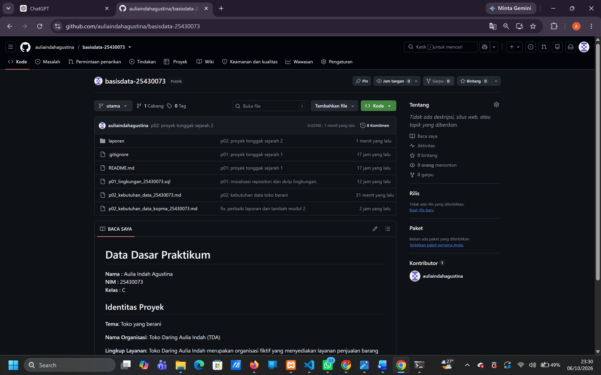
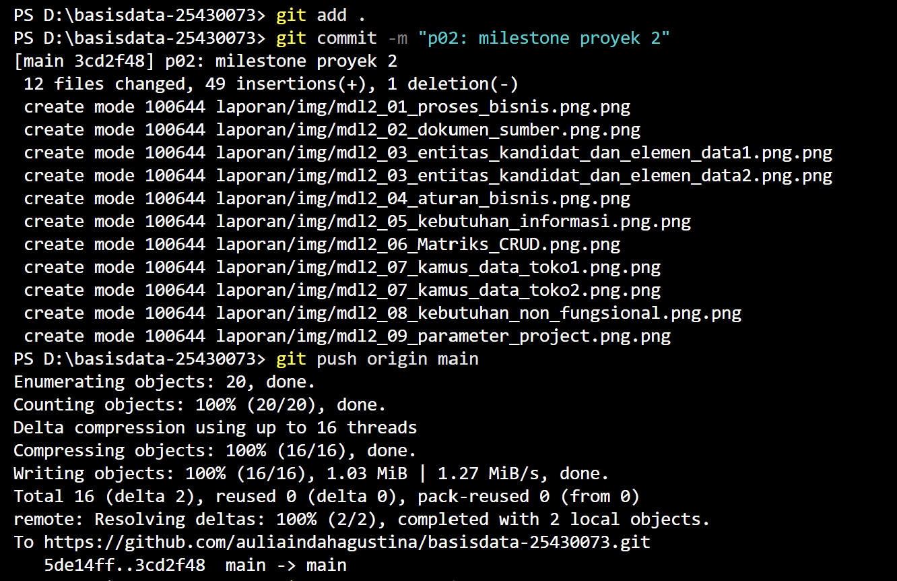

## Checklist 

| No. | Checklist Umum | Status |
|---|---|:---:|
| 1 | Identitas: nama, NIM, kelas, nomor pertemuan, tanggal, serta nama dosen/asisten | ☑️ |
| 2 | Tujuan praktikum ditulis dengan bahasa sendiri dan maksimal 5 baris | ☑️ |
| 3 | Ringkasan dasar teori ditulis berdasarkan pemahaman sendiri dan maksimal setengah halaman | ☑️ |
| 4 | Hasil langkah percobaan dilengkapi tangkapan layar dan keterangan | ☑️ |
| 5 | Semua Titik Analisis (TA) dijawab dan disertai alasan | ☑️ |
| 6 | Hasil latihan dan modifikasi dicantumkan beserta bukti | ☑️ |
| 7 | Tugas Mandiri/Milestone Proyek dikerjakan dan dilengkapi bukti | ☑️ |
| 8 | Pembahasan dan kendala selama praktikum dijelaskan beserta solusinya | ☑️ |
| 9 | Kesimpulan berisi hasil yang diperoleh dari praktikum | ☑️ |
| 10 | Pernyataan penggunaan AI dicantumkan secara jujur | ☑️ |
| 11 | Bukti Git berupa tautan repositori dan hash commit dicantumkan | ☑️ |
| 12 | Bukti keaslian pengerjaan/screenshot menunjukkan informasi yang diperlukan sesuai ketentuan | ☑️ |

## Bukti Cek Turnitin